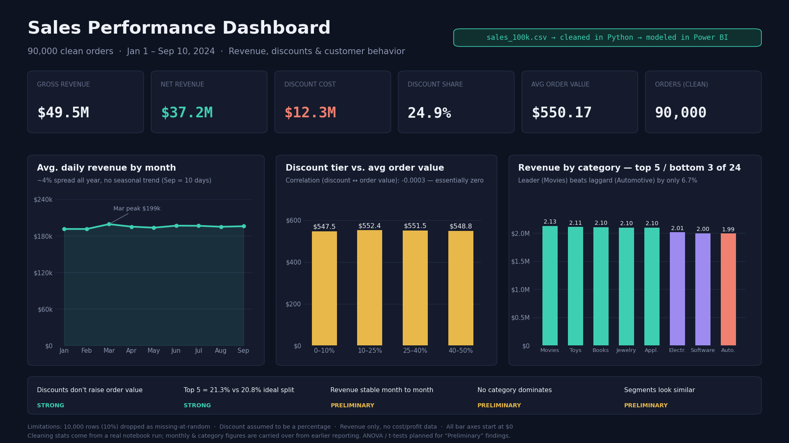

# Sales Performance Analysis

End-to-end analysis of 100,000 sales orders (Jan 1 – Sep 10, 2024): data cleaning and validation in Python, dashboard in Power BI.

## Key numbers

| Metric | Value |
|---|---|
| Clean orders | 90,000 (10,000 rows dropped) |
| Gross revenue | $49.5M |
| Net revenue | $37.2M |
| Discount cost | $12.3M (24.9% of gross) |
| Average order value | $550.17 |

## Business questions

1. What are gross vs. net revenue, and what do discounts cost?
2. How does revenue move over time?
3. Which product category earns the most, and is the gap real?
4. Do bigger discounts lead to bigger orders?
5. Which customers (age / gender) order at higher value?
6. Is any weekday or part of the month stronger?
7. Is revenue concentrated in a few categories?

## Findings and confidence

| Finding | Evidence | Confidence |
|---|---|---|
| Discounts don't raise order value | Correlation -0.0003 on 90,000 orders | Strong |
| Revenue is spread evenly across categories | Top 5 = 21.3% vs. 20.8% ideal split | Strong |
| Revenue is stable month to month | ~4% spread over 9 months | Preliminary |
| No category clearly dominates | 6.7% gap between top and bottom of 24 | Preliminary |
| Customer segments look similar | Under 1% gap across age and gender | Preliminary |

**Strong** = backed by a formal statistical measure or an unambiguous gap on a large sample.
**Preliminary** = a real pattern that still needs ANOVA / t-tests to rule out chance.

## Data cleaning highlights

- 10,000 rows (10%) were missing `Sales_Amount`, `Discount`, `Customer_Age` and `Customer_Gender`, all four in the same rows.
- A chi-square test showed the missingness is unrelated to month (p = 0.73) or category (p = 0.50), so the rows were dropped rather than imputed.
- `Discount` ranges 0–50 and is treated as a percentage.
- No duplicate rows; `Sales_ID` is unique.
- `Sales_Region` and `Sales_Representative` are high-cardinality and were excluded from grouped analysis.

## Limitations

- Monthly and category revenue figures were carried over from earlier reporting and were not recomputed from raw rows in the final review.
- `Discount` is assumed to be a percentage. If it is an absolute amount, all net-revenue figures must be recalculated.
- Revenue only: no cost or profit data.
- No repeat-purchase data.
- ANOVA / t-tests for the "Preliminary" findings are planned but not yet run.

## Files in this repository

| File | Description |
|---|---|
| [`sales_analysis.ipynb`](sales_analysis.ipynb) | Python notebook: data understanding, cleaning, and quality checks |
| [`Sales_Analysis_Presentation.pptx`](Sales_Analysis_Presentation.pptx) | Presentation: methodology, findings, recommendations, limitations |
| [`sales_dashboard_00.png`](sales_dashboard_00.png) | Dashboard screenshot |

## Tools

Python (pandas, NumPy, SciPy, matplotlib, seaborn), Power BI.

**Dataset:** `sales_100k.csv` (not included in this repo).
